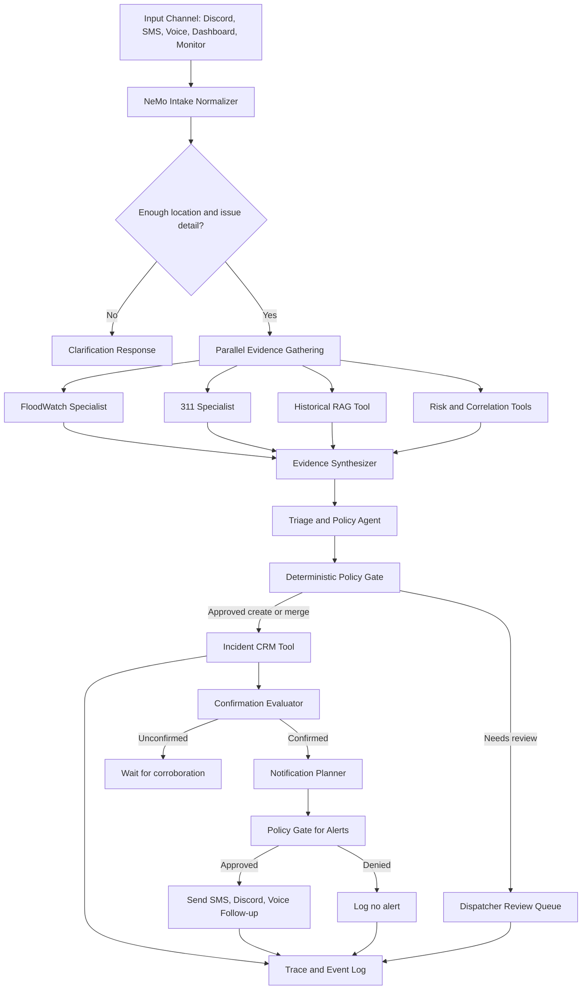

# GridWatch Agentic Architecture Review

Date: 2026-07-30

> **Status note.** These three documents describe the system *as it was found*
> and the plan that followed. Most of that plan has since landed: retrieval no
> longer uses ChromaDB (it is a hosted OpenSearch index behind a custom NAT
> retriever provider), inference runs on NVIDIA-hosted Nemotron, and the NAT
> workflow is the live path. Read them as the diagnosis and the plan; read
> `TESTING.md` and `DEPLOY.md` for how the system works today.


## Executive Summary

GridWatch has the right ingredients for an agentic urban operations system: live NYC data tools, a local Nemotron model, NeMo Agent Toolkit configuration, ChromaDB retrieval, citizen input channels, incident state, alert subscriptions, and a background monitor. The main architectural issue is that these pieces are not yet operating as one agentic workflow.

The README describes a 26-tool NeMo ReAct agent and multi-agent dispatch system, but the runtime server currently disables NeMo startup and the monitor loop because the agent path causes Ollama to hang. The live `/generate` endpoint mostly runs a hand-built fallback: it injects RAG context, asks Nemotron through Ollama for a response, parses a markdown `action` block, and executes database mutations directly. Discord, SMS, voice, webhook reports, alerts, and monitor logic each implement their own classification, geocoding, and incident creation behavior.

The strongest improvement is to make NVIDIA NeMo Agent Toolkit the actual control plane for the dispatch workflow, not an optional branch. Use deterministic Python services for data access and policy enforcement, but let NeMo coordinate perception, tool selection, cross-checking, triage, escalation, notification planning, and follow-up tasks through a durable, observable workflow.

## Current Agentic Workflow

### 1. Data and Knowledge Layer

- SQLite stores incidents, incident history, votes, and alert subscriptions in `src/hackathon_nyc/db.py`.
- ChromaDB stores historical NYC records for RAG. `src/hackathon_nyc/tools/historical_lookup.py` can search across 311, collisions, potholes, rodent inspections, housing violations, and flood events.
- Live tools query FloodNet, NYC Open Data, geocoding, and historical lookup from `src/hackathon_nyc/tools/`.
- Correlation and backtest scripts exist as offline analysis assets, not yet first-class tools in the active agent workflow.

### 2. NeMo Agent Toolkit Layer

- `src/hackathon_nyc/register.py` registers NeMo/NAT function groups:
  - `nyc_flood_tools`
  - `nyc_311_tools`
  - `nyc_geo_tools`
  - `nyc_crm_tools`
  - `parallel_agent_query`
- `src/hackathon_nyc/configs/config_unified.yml` defines one ReAct agent with flood, complaint, geocoding, CRM, alert, and date tools.
- `src/hackathon_nyc/configs/config_orchestrator.yml` defines a more agentic design: a master ReAct orchestrator routes to a FloodWatch specialist, a 311 Command Center specialist, or a parallel executor that queries both.
- `src/hackathon_nyc/configs/config_floodwatch.yml` and `config_311.yml` define standalone specialist agents.

This is the most promising architecture in the repo, but it is not currently active in the FastAPI lifespan.

### 3. Runtime Server and Dispatcher Chat

- `src/hackathon_nyc/server.py` initializes RAG, but NeMo initialization is commented out.
- `/api/agent/status` reports whether the NeMo workflow and RAG collection are loaded.
- `/generate` first tries `_nemo_workflow` if available. Since startup disables it, the server normally falls back to a custom dispatcher prompt.
- The fallback path retrieves current incidents, sometimes queries historical RAG, calls Ollama directly, asks the model to emit one markdown `action` block, then parses and executes that action.
- The fallback action set overlaps with CRM tools in `register.py`, creating duplicate behavior outside NeMo.

### 4. Citizen Input Channels

- Discord uses keyword detection and forwards reports to `/api/webhook/report`.
- Twilio SMS performs local keyword classification, geocoding, subscription handling, and incident creation.
- Twilio voice can stream to a Pipecat pipeline using Whisper, Nemotron via Ollama, and Kokoro TTS.
- The Pipecat voice code has its own tool schemas and handlers, separate from the NeMo/NAT tools.
- `/api/webhook/report` performs its own address cleanup, category detection, urgency scoring, geocoding, incident creation, and alert sending.

### 5. Monitoring and Automation

- `src/hackathon_nyc/monitor_agent.py` polls FloodNet and 311 concurrently, creates incidents from flood depth, cross-references flood sensor spikes with 311 reports, and detects 4x complaint spikes by zip/category.
- The monitor is rule-based and useful, but it is disabled in server startup.
- Monitor state is module-level memory, so seen IDs and complaint history reset on process restart.

### 6. OpenClaw Skills

- Skills in `skills/` describe dispatch triage, flood monitoring, risk assessment, and Discord behavior.
- These are good domain contracts, but they are not clearly wired into the runtime path. Today they read more like documentation/prompts than active orchestrated skills.

## Key Issues in the Current Workflow

### 1. NeMo Is Designed But Not Operational

The project's agentic claim depends on NeMo, but `server.py` comments out `_init_nemo_agent()` with the note that it causes Ollama to hang. The monitor is also disabled with a comment saying it depends on the agent. This means the advertised NeMo ReAct workflow is usually not the real workflow.

Impact:

- Tool orchestration is bypassed.
- Specialist agent configs are unused.
- The live system depends on prompt parsing and endpoint-specific logic.
- Debugging agent behavior becomes harder because the NeMo path and fallback path can diverge.

### 2. Port and API Configuration Drift

NeMo configs use Ollama's OpenAI-compatible endpoint at `http://localhost:11434/v1`, while the fallback chat path posts to `http://localhost:11435/api/chat`. The README uses `ollama serve`, which normally listens on `11434`. This mismatch is likely one cause of confusing runtime behavior.

Impact:

- NeMo can be configured correctly while fallback chat fails, or vice versa.
- Local development behavior depends on undocumented port setup.
- A hang may be caused by transport/config mismatch rather than agent architecture.

### 3. There Is No Single Agent Control Plane

The same conceptual tasks are implemented in multiple places:

- Category detection appears in Discord, SMS, webhook, voice, and prompts.
- Geocoding logic is duplicated in alert subscription, webhook, Twilio, voice, and chat action execution.
- Incident creation happens through REST endpoints, direct `db.create_incident` calls, NeMo CRM tools, webhook code, SMS code, and Pipecat tools.
- Alert checks and alert sends are scattered across confirmation endpoints, webhook logic, Twilio, and NeMo tool descriptions.

Impact:

- Agent behavior is inconsistent by channel.
- Fixes in one path do not improve other paths.
- Policies like confirmation-before-alerting are easy to violate.
- It is hard to prove what the system will do for the same report across Discord, SMS, phone, and dashboard chat.

### 4. Anti-Spam and Confirmation Policy Is Inconsistent

The NeMo prompt says only confirmed incidents trigger alerts. The database has confirmation support through dispatcher confirmation, report counts, and voting. However `/api/webhook/report` sends SMS alerts to nearby subscribers immediately after incident creation when coordinates exist, without clearly checking whether the incident is confirmed.

Impact:

- Citizen reports can trigger alerts before the anti-spam confirmation rule is satisfied.
- The documented policy and runtime behavior disagree.
- A malicious or mistaken report can produce outbound notifications.

### 5. The Fallback LLM Action Path Is Fragile

The fallback dispatcher asks the model to emit a markdown code block containing JSON. The server then parses the block and directly performs create, update, confirm, assign, resolve, delete, search, and alert actions.

Impact:

- No typed action contract.
- No explicit policy gate before destructive actions like delete.
- No tool-level permission model.
- The model can produce malformed action JSON or ambiguous IDs.
- Observability is limited to the final parsed result, not the reasoning/tool trace.

### 6. Multi-Agent Design Exists But Is Not Used

`config_orchestrator.yml` is the best expression of a true agentic architecture: a master orchestrator, two specialists, and a parallel executor. But the server initializes `config_unified.yml`, and even that is disabled. The active fallback path does not route between specialists or run parallel cross-domain checks.

Impact:

- Flood and 311 reasoning are not independently validated.
- The system loses the chance to compare sensor evidence against citizen complaint evidence.
- Cross-domain insights become prompt-dependent rather than workflow-guaranteed.

### 7. RAG Usage Is Inconsistent

Server startup loads only the first Chroma collection found, while `historical_lookup` searches multiple named collections. The fallback chat uses trigger words to decide when to call historical lookup, then adds mandatory prompt instructions to force the model to acknowledge records.

Impact:

- Retrieval behavior differs depending on which path is used.
- The first collection loaded by ChromaDB may not be the relevant collection.
- Prompt-level rules try to compensate for retrieval uncertainty instead of returning a structured evidence bundle.

### 8. No Durable Agent Memory or Event Log

There is incident history, but no durable agent task state. Monitor state uses module globals. Chat history is an in-memory list. NeMo reasoning/tool traces are not persisted. There is no shared event log for report received, normalized, geocoded, classified, cross-checked, incident-created, confirmed, notified, assigned, and resolved.

Impact:

- Restarting the server loses monitor and chat context.
- The system cannot resume partial tasks.
- It is difficult to audit why an incident was created, confirmed, or alerted.
- Evaluation and regression testing of agent decisions become difficult.

### 9. Tool Safety and Input Validation Need Hardening

Several tools accept free-form strings that are interpolated into query clauses or interpreted as actions. Mutation tools include update, resolve, delete, confirm, and subscribe. The current architecture relies heavily on prompts to tell the model what to do safely.

Impact:

- Prompt instructions are not sufficient authorization boundaries.
- Tool misuse can mutate dispatch state.
- Query-building tools can become brittle or unsafe as inputs become more open-ended.

### 10. OpenClaw Skills Are Not Integrated as Executable Capabilities

The skill files describe strong workflows such as agency recommendation, repeat-location history checks, and flood risk scoring. The code implements pieces of this, but the skill definitions do not appear to be loaded by the running agent system.

Impact:

- The project has domain knowledge, but not a runtime mechanism that guarantees it is applied.
- Skills can drift from implementation.
- Agent behavior depends on whichever prompt or endpoint handled the report.

## What Should Become Agentic

### 1. Intake Normalization Agent

All citizen and dispatcher inputs should enter a single normalization workflow.

Inputs:

- Discord message
- SMS body
- voice transcript
- dashboard chat
- webhook payload
- monitor-generated signal

Outputs:

- normalized report text
- source identity
- extracted location candidates
- category candidates
- urgency evidence
- confidence score
- missing information questions

This should be a NeMo workflow/tool chain, not separate keyword blocks in each channel.

### 2. Evidence Gathering Agent

Given a normalized report, an agent should gather evidence before mutation:

- geocode address candidates
- query nearby open incidents
- check FloodNet sensors if flooding/sewer/water is suspected
- query nearby 311 records
- search ChromaDB history
- inspect vulnerability/risk layers
- optionally check weather alerts

The output should be a structured evidence packet, not a natural-language blob.

### 3. Triage and Policy Agent

This agent should decide:

- severity
- category
- confidence
- whether to create a new incident or merge with an existing one
- whether the incident is confirmed or unconfirmed
- whether human review is required
- which agency/unit should receive it
- what subscribers are eligible for alerts

The policy should be deterministic where possible. The LLM can recommend, but policy code should enforce thresholds and permissions.

### 4. Dispatch Planning Agent

Once an incident is created or updated, an agent can plan next steps:

- assign a likely responding agency or unit
- recommend escalation based on severity and vulnerable populations
- schedule follow-up checks
- ask for missing location/severity information
- summarize the incident for dispatchers
- create a concise public-facing notification only after confirmation

### 5. Monitoring Agent

The background monitor should become a durable agent loop:

- poll data sources
- detect changes since last persisted cursor
- generate candidate incidents
- cross-check sensor, 311, weather, and historical evidence
- create or update incidents through the same triage policy path as citizen reports
- escalate only when confidence thresholds are met

### 6. Analyst Agent

Backtest and correlation outputs should become callable tools:

- `get_correlation_findings(area, category)`
- `predict_incident_hotspots(time_window, category)`
- `explain_risk_score(address)`
- `compare_current_activity_to_baseline(area, category)`

This would make the dashboard chat and dispatcher summaries meaningfully analytical rather than only retrieval-based.

### 7. Notification Agent

Notifications should be planned by an agent but enforced by policy:

- only confirmed incidents can notify the public
- critical dispatcher-created incidents can bypass report-count threshold
- citizen reports require corroboration, votes, or dispatcher confirmation
- outbound message templates should be channel-specific
- notification attempts should be logged with delivery status

## NeMo-Focused Improvement Plan

### Priority 1: Make NeMo the Runtime Path Again

Fix the hang instead of leaving NeMo disabled.

Recommended steps:

1. Standardize Ollama config.
   - Use one endpoint convention across the repo.
   - Prefer `http://localhost:11434/v1` for NeMo OpenAI-compatible config.
   - If fallback uses Ollama native `/api/chat`, use `http://localhost:11434/api/chat`, not `11435`, unless a second Ollama server is intentionally documented.

2. Add startup timeout and health checks.
   - Wrap NeMo initialization in a bounded timeout.
   - Check Ollama model availability before building the workflow.
   - Expose detailed status: config loaded, plugins discovered, model reachable, workflow built, tools registered.

3. Create a minimal NeMo smoke test.
   - Load `config_unified.yml`.
   - Call a harmless tool like `current_datetime` or `get_incident_stats`.
   - Fail fast if the model/tool protocol hangs.

4. Keep fallback mode explicit.
   - Fallback should be an emergency degraded mode with limited read-only and create-only actions.
   - The UI should show `agent`, `agent+rag`, or `fallback` clearly.

### Priority 2: Promote `config_orchestrator.yml` to the Main Architecture

The orchestrator config is more agentic than the unified config. Use it as the primary NeMo workflow after the minimal smoke test passes.

Recommended target design:

- Master orchestrator: classifies request intent and routes work.
- FloodWatch specialist: FloodNet, flood history, vulnerability, weather, sensor reasoning.
- 311 specialist: complaints, trends, citizen impact, service request history.
- CRM specialist: incident mutations, assignment, confirmation, subscription checks.
- Risk analyst: correlations, backtest predictions, neighborhood risk scoring.
- Notification planner: drafts messages and chooses candidate recipients.
- Policy gate: deterministic Python tool that approves/denies mutation and notification actions.

Use `parallel_agent_query` for cross-domain evidence gathering, but add a synthesis step that compares outputs and returns structured fields such as `agreements`, `conflicts`, `missing_evidence`, and `recommended_action`.

### Priority 3: Convert Endpoint Logic Into Shared NeMo Tools

Move duplicated logic behind shared tools that all channels call.

Recommended tools:

- `normalize_report(text, source, user_context)`
- `extract_location_candidates(text)`
- `geocode_nyc_location(candidate)`
- `classify_incident(text, evidence)`
- `score_urgency(text, evidence)`
- `gather_local_evidence(lat, lon, category)`
- `find_or_create_incident(report, evidence, policy_decision)`
- `merge_report_with_incident(incident_id, report)`
- `evaluate_confirmation(incident_id)`
- `plan_alerts(incident_id)`
- `send_approved_alerts(alert_plan_id)`

The FastAPI routes, Discord bot, Twilio SMS handler, Pipecat voice handler, and monitor loop should all call this same workflow instead of each owning local logic.

### Priority 4: Use Structured Outputs Instead of Markdown Action Blocks

For the fallback path and for any NeMo agent that can mutate state, require typed structured outputs.

Suggested schema:

```json
{
  "intent": "create_incident | update_incident | answer_question | subscribe_alerts | request_clarification",
  "confidence": 0.0,
  "requires_human_review": true,
  "evidence_ids": [],
  "proposed_actions": [
    {
      "type": "create_incident",
      "args": {},
      "risk_level": "low | medium | high",
      "policy_check": "pending"
    }
  ],
  "dispatcher_summary": ""
}
```

Then route every proposed mutation through a deterministic policy tool before execution.

### Priority 5: Add NeMo Observability and Evaluation

Agentic systems need traces and regression tests.

Track:

- input report
- selected agent/workflow
- tools called
- tool inputs/outputs
- evidence used
- final decision
- policy gate result
- incident mutation ID
- notification result
- latency and model/token metrics
- failures and retries

Add an evaluation suite with scenario fixtures:

- duplicate flood reports near the same sensor
- false alarm report with no location
- high-urgency gas leak
- dispatcher asks for sitrep
- citizen asks to subscribe
- historical risk question near a known hotspot
- malicious or ambiguous delete/resolve request

For each fixture, assert expected tool sequence, no unauthorized alerts, correct incident state, and acceptable response shape.

### Priority 6: Integrate NeMo Guardrails or Equivalent Policy Gates

For a dispatch system, model behavior should be constrained by policy.

Guardrails should cover:

- do not claim emergency services were dispatched unless the system actually dispatched them
- do not send public alerts for unconfirmed citizen reports
- require human confirmation before delete, mass alert, or critical escalation unless trusted source policy permits it
- refuse unsupported medical/legal advice
- ask clarifying questions when location is missing
- keep citizen-facing voice/SMS responses short and non-alarming

If NeMo Guardrails is not added, implement equivalent deterministic guard tools and make every mutation call depend on them.

### Priority 7: Use NVIDIA Platform Strengths Beyond Local Inference

The project already uses local Nemotron via Ollama. Improvements that would make the NVIDIA angle stronger:

- Treat Nemotron as the reasoning model inside NeMo Agent Toolkit, not just a chat completion endpoint.
- Use the GB10/local GPU story for low-latency voice and on-device privacy, especially STT plus LLM plus TTS.
- Add model performance metrics: time to first token, full response latency, tool-call latency, concurrent sessions, and memory usage.
- Consider TensorRT-LLM or NVIDIA NIM if deployment moves beyond Ollama and hackathon constraints.
- Add a NeMo-based benchmark notebook or script comparing unified agent versus orchestrated specialists on dispatcher tasks.
- Keep ChromaDB retrieval local, but expose retrieval as a typed NeMo tool with collection filters and citations/evidence IDs.

## Concrete Target Workflow



## Recommended Implementation Phases

### Phase 1: Stabilize NeMo Runtime

- Fix Ollama endpoint drift.
- Add NeMo startup timeout and status details.
- Add a small smoke test for `config_unified.yml`.
- Re-enable `_init_nemo_agent()` only after smoke test passes reliably.
- Keep monitor disabled until incident mutation policy is centralized.

### Phase 2: Centralize Intake

- Extract webhook category, urgency, and geocoding logic into shared tools/services.
- Route Discord, SMS, voice post-call, dashboard chat, and webhook reports through one intake workflow.
- Remove direct duplicate category/geocoding implementations from channel handlers.

### Phase 3: Centralize Policy and Mutations

- Add a policy gate for create, merge, confirm, delete, resolve, assign, subscribe, and alert actions.
- Make alerts require confirmed incidents except for explicit trusted-source exceptions.
- Add human-review requirements for destructive actions and low-confidence incidents.

### Phase 4: Use the Multi-Agent Orchestrator

- Promote `config_orchestrator.yml` or create a new `config_gridwatch_orchestrator.yml`.
- Add CRM, risk, and notification specialists.
- Add structured synthesis after parallel specialist calls.
- Persist traces for every tool call and final decision.

### Phase 5: Make Monitoring Agentic and Durable

- Persist monitor cursors in SQLite.
- Convert monitor outputs to normalized report events.
- Send monitor events through the same evidence, triage, and policy workflow.
- Add weather alert checks and prediction/correlation tools.

### Phase 6: Evaluation and Demo Readiness

- Build scenario tests for the main dispatch flows.
- Add latency and trace reporting for NeMo runs.
- Add a dashboard-visible agent status panel: mode, model, workflow, tools, last trace, and degraded-mode reason.
- Document exact local NVIDIA/Ollama setup and expected ports.

## Highest-Value Specific Fixes

1. Reconcile Ollama ports: use `11434` consistently unless intentionally running a second server.
2. Re-enable NeMo behind a health-checked startup path with timeout.
3. Use `config_orchestrator.yml` as the main design direction rather than the one-agent `config_unified.yml`.
4. Stop sending webhook alerts before confirmation; enforce the confirmation policy in one place.
5. Replace markdown action parsing with typed structured action proposals plus a policy gate.
6. Move Discord, SMS, voice, webhook, and chat incident creation through a single intake workflow.
7. Persist agent traces and monitor cursors.
8. Turn correlation and backtest outputs into callable analyst tools.
9. Integrate OpenClaw skill intent into executable NeMo tools/workflows or remove claims that they are active agents.
10. Add a NeMo evaluation harness with fixtures for duplicate reports, flood corroboration, subscriptions, sitreps, and unsafe mutations.

## Bottom Line

GridWatch is close to a compelling agentic architecture, but the current runtime is more of a multi-channel application with LLM-assisted endpoints than a unified multi-agent system. The NeMo/NAT files show the right direction, especially the parallel orchestrator, but the active server bypasses them. The next architectural step is to make NeMo the orchestrator of a shared, policy-governed workflow while keeping data access, incident mutation, and alert enforcement deterministic and auditable.
